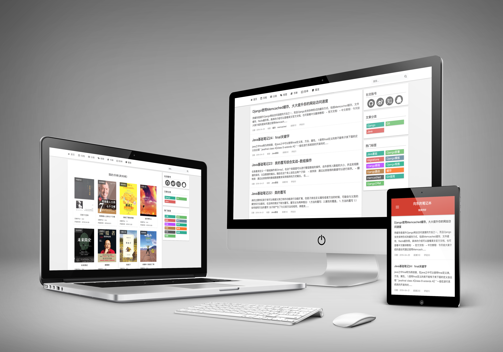

# DjangoEast
走过路过不要错过，来瞧一瞧看一下了哈，本网站基于`Django2.0`和`Python3.6`,开发完成，是一个非常适合喜欢读书，喜欢看电影，喜欢做笔记，喜欢写代码的朋友使用的个人博客网站。欢迎有眼光的你下载下来使用一下~



## 1. 主要功能
- 支持访客留言功能
- 支持登录和注册功能
- 文章可按日期、分类、标签等多种形式展示
- 网站后台使用xadmin，弥补了原生后台难看的缺点
- 文章底部支持多级评论，评论框支持富文本、`Markdown`
- 文章撰写支持`Markdown`编辑器，文章页展示支持代码高亮
- 支持添加书单、影单功能，很适合喜欢读书，喜欢看电影的朋友
- 支持全站关键词搜索，搜索范围是文章标、内容，搜索结果关键词高亮显示
- 更多功能，敬请期待......

## 2. 本地安装
### 2.1 下载网站到本地
```bash
git clone https://github.com/mxdshr/DjangoEast.git
```
### 2.2 安装运行环境
```bash
pip install -r requirements.txt
```
### 2.3 修改配置文件
打开 `django/settings.py`文件，找到下面的代码，填写数据库信息
```python
DATABASES = {
    'default': {
        'ENGINE': 'django.db.backends.mysql',
        'NAME': '数据库名',
        'USER':'数据库账户名',
        'PASSWORD':'数据库账户密码',
        'PORT':'3306',
        'HOST':'localhost',
    }
}
```
### 2.4 数据库迁移
网站根目录下终端执行
```bash
python manage.py makemigrations
python manage.py migrate
```
### 2.5 运行测试
网站根目录下终端执行
```bash
python manage.py runserver 127.0.0.1:8000
```
## 3. 线上部署
请参考：[(超详细)Django线上部署教程：腾讯云+Ubuntu+Django+Uwsgi](https://www.eastnotes.com/post/29)
## 4.更新日志
### 2019.3.7
- 文章目录去掉无序列表的圆点
- 修改相关文章的文章标题的显示效果
- 修改文章列表页文章标题显示长度，30→50
- 修复mdeditor编辑器上传图片无法显示的问题
- 取消git对项目下的upload与media文件夹的跟踪
- 去除文章摘要中的">"字符，在结尾添加"......"
- 删除templates/blog/base.html文件（还未同步）
- 修改tag_list页面下文章显示顺序，刚发表的排在前面
- 修改了STATIC_ROOT的参数，使collectstatic操作正常

### 2019.3.8
- 修改文章页底部相关文章的个数：8→4
- 修复分类归档页面使用regroup产生的分组重复的问题

### 2019.3.10
- 修改分类目录页文章显示顺序
- 首页添加按分类展示的文章块:blockposts(移动端不显示)

### 2019.3.12
- 增加我的书单功能

### 2019.3.14
- 添加标签大全功能
- 改进文章目录功能
- 修改文章列表页文章显示

### 2019.3.15
- 书单页中有读书笔记的跳转至读书笔记页面，否则不跳转
- 添加book_list.html页面用于呈现每个图书标签下的图书

### 2019.3.17
- 添加我的影单功能

### 2019.3.20
- 修改文章列表块的样式
- 新增文章列表前的label功能
- PC端网站颜色改版，由极简黑到活力彩

### 2019.3.23
- 更改路由配置方式，由正则改为路径

### 2019.4.03
- 添加文章评论功能
- 评论二级回复功能
- 评论区支持富文本编辑器ckeditor

### 2019.4.06
- 添加评论统计功能
- 为评论者添加默认头像
- 修改博主评论显示样式
- 将获取评论列表功能写入自定义标签
- 将提交新的评论功能写入自定义标签

### 2019.4.07
- 为首页添加我的留言功能
- 后台评论功能添加按照评论对象进行筛选功能

### 2019.4.16
- 全站添加CNZZ网站统计
- 网站升级HTTPS
- 重新部署至腾讯云